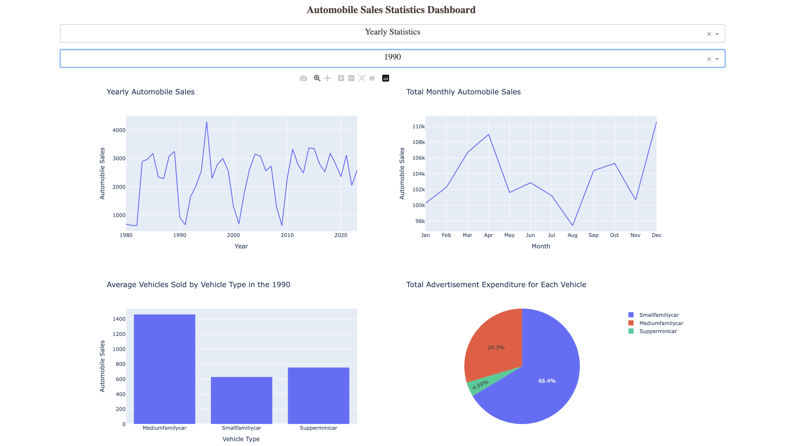

# Automobile Sales Statistics Dashboard

This project is an interactive web dashboard created using Python, Plotly, and Dash. It allows users to analyze historical automobile sales data based on recession periods and by year.

This application is a lab project completed to develop my skills during the **IBM Data Visualization with Python** course (part of the IBM Data Science Professional Certificate program).

---

## Project Preview

An example of the dashboard with "Yearly Statistics" selected:



---

## Key Features

* **Interactive Controls:** A dropdown menu to select the report type ("Yearly Statistics" or "Recession Period Statistics").
* **Dynamic Filtering:** A second dropdown menu to filter by year, which is enabled only when "Yearly Statistics" is selected.
* **Quad-Graph Layout:** A 2x2 grid layout displaying four different analyses (line, bar, and pie charts) simultaneously based on the selected filters.
* **Recession Analysis:** Shows sales trends during recession periods, average sales per vehicle type, and the share of advertising expenditure.
* **Yearly Analysis:** Displays both all-time yearly/monthly trends and a breakdown of vehicle types and advertising expenditure for a specific selected year.

---

## Technologies Used

* **Python**: The main programming language.
* **Dash**: Used to build the web application's layout and handle interactivity (callbacks).
* **Plotly Express**: Used to create interactive and aesthetic data visualizations (graphs).
* **Pandas**: Used for loading, processing, and grouping data for analysis.
* **Requests**: Used to fetch the dataset from the web.

---

## Dataset

The dataset used in this project was artificially created by IBM for the purposes of this course. It does not represent real data.

* **Data Source:** `https://cf-courses-data.s3.us.cloud-object-storage.appdomain.cloud/IBMDeveloperSkillsNetwork-DV0101EN-SkillsNetwork/Data%20Files/historical_automobile_sales.csv`

### Data Dictionary (Variables)

* **Date**: The date of the observation.
* **Recession**: A binary variable indicating recession period (1 = Recession, 0 = Normal).
* **Automobile_Sales**: The number of vehicles sold during the period.
* **GDP**: The per capita GDP value in USD.
* **Unemployment_Rate**: The monthly unemployment rate.
* **Consumer_Confidence**: A synthetic index representing consumer confidence.
* **Seasonality_Weight**: The weight representing the seasonality effect on automobile sales.
* **Price**: The average vehicle price during the period.
* **Advertising_Expenditure**: The advertising expenditure of the company.
* **Vehicle_Type**: The type of vehicles sold (Supperminicar, Smallfamiliycar, Mediumfamilycar, Executivecar, Sports).
* **Competition**: The measure of competition in the market.
* **Month**: Month of the observation extracted from Date.
* **Year**: Year of the observation extracted from Date.

---
## Running the Project Locally

To run this project on your own machine, follow these steps.

**1. Get the Code**
Clone this repository or download the files as a ZIP.
```bash
git clone https://github.com/enessariyer/Analyzing-the-Impact-of-Recession-on-Automobile-Sales.git
cd Analyzing-the-Impact-of-Recession-on-Automobile-Sales
````

**2. Install Dependencies**
This project requires the libraries listed in `requirements.txt`. To install them, run:

```bash
pip install -r requirements.txt
```

**3. Run the Application**
Execute the main Python script (assuming your file is named `app.py`):

```bash
python app.py
```

**4. View in Browser**
Open your web browser and navigate to the following address:

```
http://127.0.0.1:8050/
```
